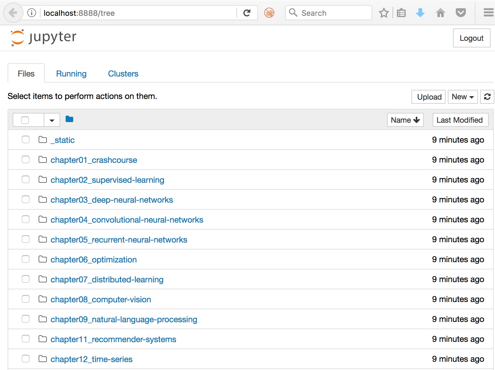
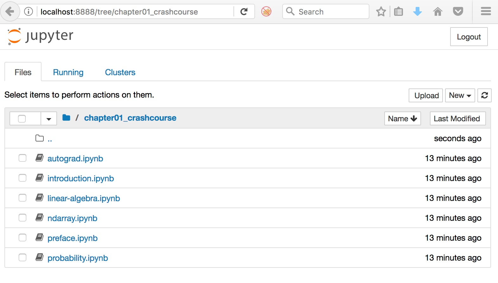
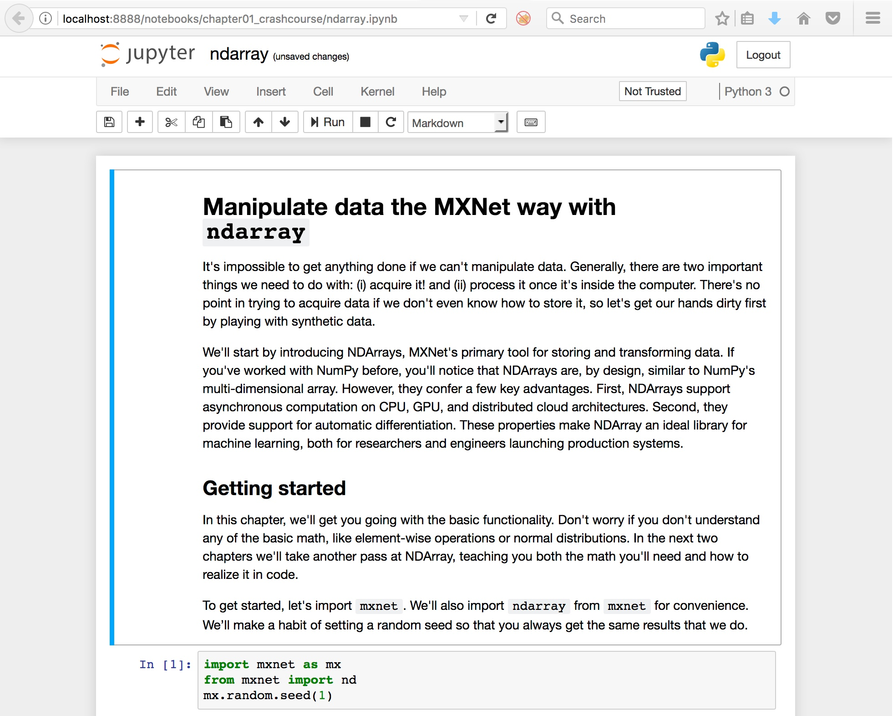
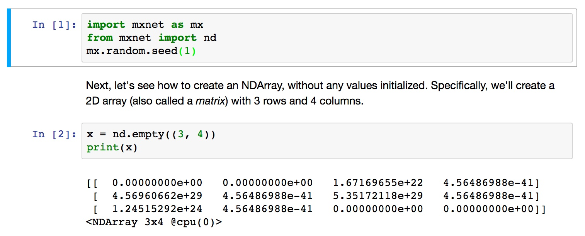
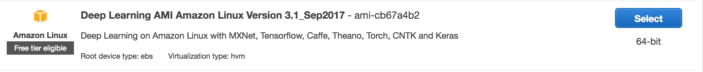
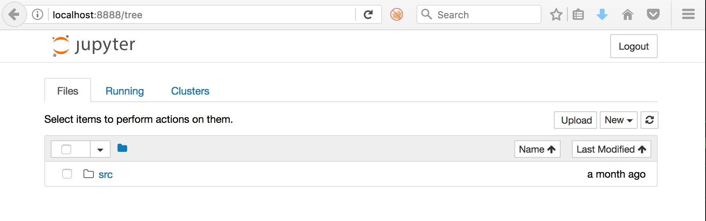
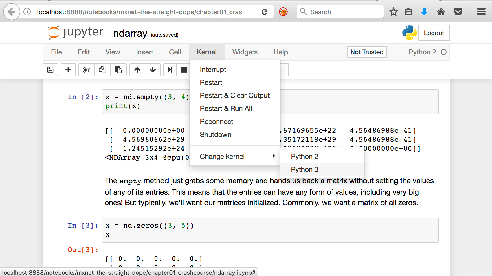

# Preparation for Deep Learning bootcamp


## Contents
1.  [Instructions](#instructions)
2.	[How to install mxnet/gluon on your own machine](#macos)
	* [macOS](#macos)
	* [Linux](#linux)
3.  [Validate the local installation](#localvalidate)
4.	[Set up the EC2 environments](#ec2env)
5.  [Validate the remote installation](#remotevalidate)


## Instructions <a name="instructions"></a>
This document describes the setup for the Deep Learning workshop. There are several tasks for you to complete in preparation:    
**0. Check/increase EC2 instance limits**   
**1. Install MXNet / Gluon locally on your own laptop**  
**2. Set up the EC2 Deep Learning environment on a CPU instance type (c4.4xlarge)**  
**3. Set up the EC2 Deep Learning environment on a GPU instance type (p2.xlarge)**

## Check/increase EC2 instance limits
Ensure you have the ability to spin up the particular instance types. For the purpose of this workshop, you will require 1x CPU instance type and 1x GPU instance type. To check your EC2 limits, go to the EC2 console and click the 'Limits' link on the left hand side. You will then see a list of your on-demand EC2 instance limits. Scroll down the list until you find the p2.xlarge instance type and ensure the value is at least one (1) or greater. 

## How to install MXNet / Gluon on your own machine (macOS) <a name="macos"></a>

Firstly, we need to create a virtual environment with Python 3 installed so we can run code with the right packages without impacting the overall environment of your laptop.  

**Step 1:** Install Homebrew and Python Development Tools
```
# Install Homebrew
/usr/bin/ruby -e "$(curl -fsSL https://raw.githubusercontent.com/Homebrew/install/master/install)"
export PATH=/usr/local/bin:/usr/local/sbin:$PATH

# Opt out of Homebrew analytics
brew analytics off

# Install python development tools - python3, pip3, python-setuptools
brew install python3
```

**Step 2:** Install virtualenv for macOS

```
pip3 install virtualenv
```

***Note:*** If you receive an error saying 'pip3: command not found' try typing `pi` at the command prompt then hitting `Tab` twice to see if it is listed as another version such as `pip2`, `pip2.7` or `pip`

**Step 3:** Create and activate the virtual environment for the labs

The below will create what is called a 'virtual environment' in the `~/mxnet` directory. You are free to choose whatever directory you wish to run the virtual environment in. 

```
virtualenv --system-site-packages ~/mxnet
```

Activate the virtualenv environment you just created for the workshop.

```
source ~/mxnet/bin/activate
```

After activating the environment, you should see the prompt change to be the virtualenv prompt as shown below. The following commands are all to be entered in the virtual environment so please ensure you are working in your virtual environment before continuing. 

```
(mxnet)$
```

**Step 4:** Upgrade pip in virtual environment (to support MXNet install)

```
pip3 install --upgrade pip
pip3 install --upgrade setuptools
```

**Step 5:** Install Python 3 in the virtual environment

For the Deep Learning workshop we will be using Python 3

```
pip3 install python3
```

**Step 5:** Install MXNet with Gluon support
```
pip3 install mxnet --pre
```

**Step 6:** Install additional tools: GraphViz & Jupyter Notebooks

* Graphviz (required for graph visualisation using mxnet.viz package [Link])
* Jupyter Notebook (required for interactive notebook environment [Link])

```
pip3 install graphviz
pip3 install jupyter
```

**Step 7:** Clone the Gluon tutorials into a local directory and then change to this directory
```
git clone https://github.com/zackchase/mxnet-the-straight-dope.git
 cd ~/mxnet-the-straight-dope/
```

[Now validate the local installation](#localvalidate)

## How to install MXNet / Gluon on your own machine (Linux) <a name="linux"></a>

**Step 1:** Install virtualenv for linux

```
sudo apt-get update
sudo apt-get install -y python3-dev python-virtualenv
```

**Step 2:** Create and activate the virtual environment for the labs

The below will create what is called a 'virtual environment' in the `~/mxnet` directory. You are free to choose whatever directory you wish to run the virtual environment in. 

```
virtualenv --system-site-packages ~/mxnet
```

Activate the virtualenv environment you just created for the workshop.

```
source ~/mxnet/bin/activate
```

After activating the environment, you should see the prompt change to be the virtualenv prompt as shown below. The following commands are all to be entered in the virtual environment so please ensure you are working in your virtual environment before continuing. 

```
(mxnet)$
```

**Step 3:** Install libatlas-base-dev dependency for MXNet
```
#Fix to install libatlas-base-dev as per this issue: https://github.com/apache/incubator-mxnet/issues/5290 
sudo apt-get install libatlas-base-dev
```

**Step 4:** Install MXNet with Gluon support
```
pip3 install mxnet --pre
```

**Step 5:** Install additional tools: GraphViz & Jupyter Notebooks

* Graphviz (required for graph visualisation using mxnet.viz package [Link])
* Jupyter Notebook (required for interactive notebook environment [Link])

```
pip3 install graphviz
pip3 install jupyter
```

**Step 6:** Clone the Gluon tutorials into a local directory and then change to this directory
```
git clone https://github.com/zackchase/mxnet-the-straight-dope.git
cd ~/mxnet-the-straight-dope/
```

[Now validate the local installation](#localvalidate)


## Validate the local installation <a name="localvalidate"></a>

Remaining in your virtual environment, start your Jupyter Notebook server from the `mxnet-the-straight-dope` directory (there will be a pause the first time this is run.)
```
jupyter notebook
```

After running this command, it should automatically open your browser and show the notebook environment. If it fails to auto open, copy/paste the URL shown in the terminal window into your browser. For example: 

```
(mxnet)$ jupyter notebook
[I 09:03:12.592 NotebookApp] Serving notebooks from local directory: /Users/myuserid
[I 09:03:12.592 NotebookApp] 0 active kernels
[I 09:03:12.592 NotebookApp] The Jupyter Notebook is running at:
[I 09:03:12.593 NotebookApp] http://localhost:8888/?token=a1ba30c3b65b0edcfe96a904e22721460a6977476b85f4a4
[I 09:03:12.593 NotebookApp] Use Control-C to stop this server and shut down all kernels (twice to skip confirmation).
[C 09:03:12.599 NotebookApp] 
    
    Copy/paste this URL into your browser when you connect for the first time,
    to login with a token:
        http://localhost:8888/?token=a1ba30c3b65b0edcfe96a904e22721460a6977476b85f4a4
```

You should then see something similar to the following:




Navigate to the `chapter01_crashcourse` directory:




Open the `ndarray.ipynb` notebook




Run the first two blocks of code by clicking on the cells and pressing 'Shift+Enter' on each. You should see the following output:


**Congratulations, your local environment is now ready!**


# Preparing the Deep Learning AMI environments on EC2 <a name="ec2env"></a>

For the Deep Learning environment we are going to be using a CPU-based host (c4.xlarge) and also a GPU-based host (p2.xlarge) to demonstrate the difference between the two instance types. You need to set up **both a CPU and a GPU host** based on the below configuration. Note the extra step for the GPU instance type but otherwise the setup is the same. 

**Step 1:** Launching the compute instance
- Open the [AWS Console](https://console.aws.amazon.com/console/home)
- Select `eu-west-1` as the region 
- Choose EC2 from the list of services
- Click the 'Launch Instance' button. 
- From the Quick Start AMI selection, choose `Deep Learning AMI Amazon Linux Version 3.1_Sep2017` and press Select

 

- Select the c4.xlarge instance type if running the CPU instance type 

- Alternatively select the p2.xlarge if running the GPU instance type


- Click the 'Review & Launch' button at the bottom of the screen
- Review the settings and ensure you are happy with the selection. We can leave the defaults for the workshop
- Select the 'Launch' button and either select an existing Key Pair or create a new one so you can log into the host
- Select 'Launch Instance'

**Step 2:** Setting up the instance

During the workshop, you will be securely accessing the Jupyter notebook server on your host and will therefore need to map port `8888` (default Jupyter notebook port) to your local machine in order to connect via the browser. This is accomplished via the `ssh -L` command.

1. Identify the instance and the public DNS / IP address associated with it.

2. Once the status checks have completed, open a terminal and ssh to host, replacing the host address and private key with your own.
```
ssh -L 8888:localhost:8888 -i <YOUR PRIVATE KEY> ec2-user@<YOUR INSTANCE ADDRESS> 
```

3. Change to the MXNet directory, and clone the Gluon tutorials.
```
cd ~/src/mxnet
git clone https://github.com/zackchase/mxnet-the-straight-dope.git
```

**Step 3:** GPU-only - install CUDA 8.0 support for MXNet.
```
sudo pip3 install mxnet-cu80 --pre
```

***Ensure you have repeated the above for both CPU and GPU environments***

## Validate the EC2 installation <a name="remotevalidate"></a>

1. Log on via SSH to the instance (see Step 2.2 above) and start the Jupyter Notebook server (there will be a pause the first time this is run.) 
```
jupyter notebook
``` 

2. Copy/Paste the URL shown in your terminal into your browser to access the notebook. 


3. Ensure you are using the Python 3 Kernel.


4. Verify MXNet is installed and working as expected:

- Navigate to the `mxnet-the-straight-dope/chapter01_crashcourse` directory:


- Open the `ndarray.ipynb` notebook


- Run the first two blocks of code by clicking on the cells and pressing 'Shift+Enter' on each. You should see the following output:


**Congratulations, your EC2 environment is ready to go!**

